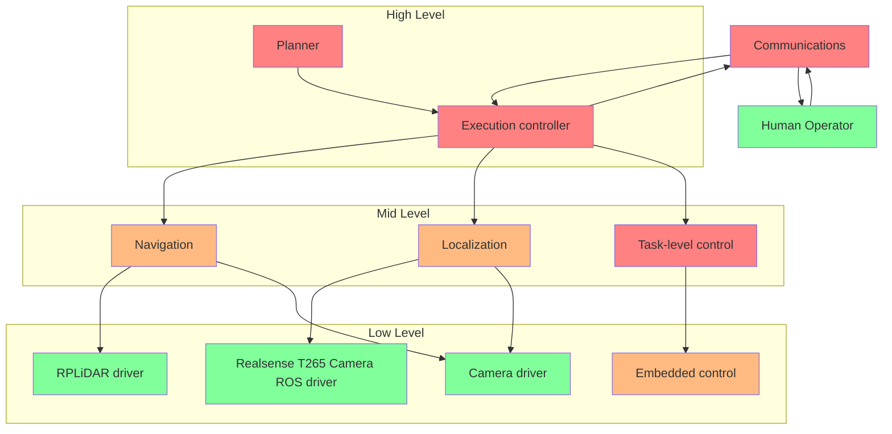

# Docs

## How to use this if you're new

From the diagram and subsection descriptions, you can hopefully get a preliminary high-level understanding of each of the parts and how they fit together. 

From this, you can then:

1. Choose which subsection interests you most 
2. Follow links in the specified subsection to get more contextual understanding (Optionally ask questions in the Discord, hop in a voice chat, etc for more fun convo about the area)
3. Ensure you understand the prerequisites for each subsections with practical understanding/experience by completing a step-by-step tutorial using those prerecs (**Can be done concurrently with #2**)
4. At this point, you should have enough knowledge/experience in your subsection to contribute to the current approach and possibly even change what the current approach is if you find better ways to do things (if so, update these docs!) 

## Architecture Diagram 

## High-level

### Planner/Human 

**Problem**

At any given time, how does the robot know what to do next? This is the job of the planner. 

**Current solution**

To do this, it utilizes an [FSM](https://en.wikipedia.org/wiki/Finite-state_machine), which models all the states the robot can be in and how they are connected and then deterministically chooses which action to complete next, then feeds it to the execution controller.

Also, if necessary, the human operator can also determine which actions to complete and can provide that information to the execution controller.

**Prerequisites to implement**
- [Python]()
- [ROS]()
- [FSMs]()

### Execution Controller

Regardless of who is sending the commands, there needs a controller that make a request to complete a certain task and then respond if the task was successful, allowing for the planner or manual controller to execute the next command. This is the job of the execution controller. Also, it can provide helpful logging information. 

**Prerequisites to implement**
- [Python]()
- [ROS (Specifically ROS Service/Client)]()
- Understanding of how the different mid-level nodes are implemented

## Mid level

### Navigation

**Problem**

Given a current location and target location, how do we move between current and target location without running into obstacles efficiently?

**Current Solution**

It is feasible to use the A star path planning algorithm and populate obstacles using LiDAR + camera fusion. 

**Prerequisites**

For pure navigation:
- [A star algorithm]()

For obstacle detection:
- [Python]()
- [ROS]()
- [LiDAR]()
- [Camera]()
- [Sensor fusion]()

### Localization

**Problem**

Where is the robot at any given time? Knowing this with high accuracy is really critical to other subsections such as navigation. But, a problem quickly emerges that each sensor that we use can output trashy data (i.e camera gets dust on it, wheels slip so encoders are off, liDAR can [behave weirdly](https://www.nasa.gov/sites/default/files/atoms/files/13_rmc2017_glossary_rev01_2c_10042016.pdf)). So, how do we use this?

**Current Solution**

We can create a sensor-redundant robust localization system, including both intrinsic and extrinsic locaization.

Intrinsic localization is the robot's location from its starting point and can be determined in any environment, as it does not rely on external references. 

This is currently done with the Intel Realsense T265 localization camera. Using wheel encoders and calculating odometery is not dependable as the terrain results in lots of slippage, therefore adding lots of error. 

Extrinsic localization is the robot's location from the collector bin, which is the ground truth to the rest of the robot's environment, since it we know the environment in reference to the bin with decent accuracy prior to the actual competition. 

This is currently planned to be done using [sensor fusion](https://www.sciencedirect.com/topics/engineering/sensor-fusion) between distance measurements from the BLE signals emitted by a BLE beacon between the robot and a tracker attached to the bin, and triangulated distance measurements of Apriltags. It could be possible to use LiDAR as well.

**Prerequisites to implement**

- [ROS]()
- [Python]()
- [Sensor fusion]()
- [Using Apriltags]()
- [T265 camera]()

### Communications

The robot we're building is designed to operate on the Moon. Naturally, there is bandwidth and latency limitations that we need to take into consideration. 

Therefore, having most of the compute and decision making done on the robot itself and using ROS's [Multi Machine] approach, seems the most reliable and bandwidth saving system.

One tradeoff of limiting bandwidth usage and latency is less diagnostics and realtime feedback from the robot (meaning that we would need more confidence and testing to ensure system performance).

**Prerequisites**
- [Monitoring bandwith/latency usage from a router]()
- [Understanding how ROS messages (manual control messages sent to the robot and diagnostic data sent back to team computer)]()

### Task-level Control 

In past competition, the goal of the lunar robot was to excavate gravel. From this, the tasks such as excavation of gravel and then deposition of the gravel into the bin would be converted to higher-level instructions that interact with the embedded controllers of each subsystem to follow through the execution of the task. 

Similar to excavation or deposition, any other new task closely follows a similar pattern. 

**Prerequisites**
- [Python]()
- [ROS]()
- [PID Controllers]()

## Low level

### Sensor Drivers 
The camera, liDAR, BLE beacon all output raw data in bytes. This information needs to be processed and packaged up to make it easier for other components to use it.

This is done mainly through using existing ROS packages such as [rplidar_ros](), [image_proc](), [cv_camera], etc 

**Prerequisites**
- [Purchasing a BLE beacon]()
- [Recieving/processing BLE data using ROS]()
- [Processing LiDAR data using ROS]()
- [Processing camera data and using ROS]()
- [Processing t265 camera data and using ROS]()

### Embedded control 

Each hardware-related system (i.e drivetrain, excavation, deposition) has a controller that ensures the execution of a given command using a simple control scheme with switches and encoders (i.e PD loop to ensure that the given set speed is reached by each wheel). 

**Prerequisites**
- [Arduino/C/C++]()
- [ROS]()
- [PID Controllers]()

# Resources

**Competition Guidelines**: Not released yet 

## Tools

### ROS  

- [ARC ROS tutorials (Recommended)](https://wiki.purduearc.com/wiki/tutorials/snake-tutorial)
- [Official ROS tutorials](http://wiki.ros.org/ROS/Tutorials)

### GitHub
- [Learn Git under 10 min](https://www.freecodecamp.org/news/learn-the-basics-of-git-in-under-10-minutes-da548267cc91/)

### C++
- [In depth tutorial playlist for C++](https://www.youtube.com/watch?v=18c3MTX0PK0&list=PLlrATfBNZ98dudnM48yfGUldqGD0S4FFb) 
  - Recommended topics:
    - if/else, loops, functions, classes
    - Pointers/References
    - Smart pointers
    - Dynamic Arrays (std::vector) 
- Very useful numeric libraries
  - [Eigen](https://eigen.tuxfamily.org/index.php?title=Main_Page): Extremely efficient matrix math library

### Python
TODO

### Arduino
TODO

### Good coding practices 
TODO

## Algorithms, Theory, Math 
### Sensor Fusion
TODO

### Planning Algorithms 
TODO

### FSMs 
TODO

### Control Algorithms 
TODO

## Sensor related 

### Bluetooth Low Energy (BLE)
- [Adding WiFi/BLE receiving to a Jetson](https://www.jetsonhacks.com/2019/04/08/jetson-nano-intel-wifi-and-bluetooth/)

### LiDAR
- [RPLidar ROS Library]()

### Camera
- [Camera driver ROS package]()
- [Camera calibration ROS package]()

## Misc

### Communication Networking 
TODO
