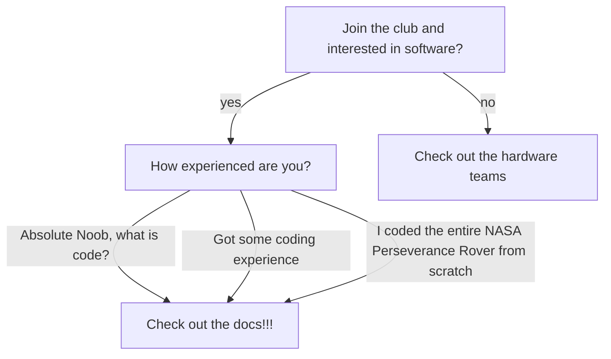

## About
Our team builds the brains of the lunabotics lunar robot by solving problems across robot navigation, localization, and task-specific challenges for the NASA Lunabotics Competition.

## Getting Started Flowchart

> Moral of the above flowchart is that it doesn't matter how much experience you have, only difference is that those with more experience tend to have higher rates of progression (i.e learning is exponential with more experience)
